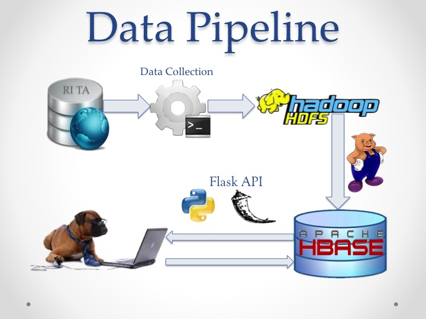
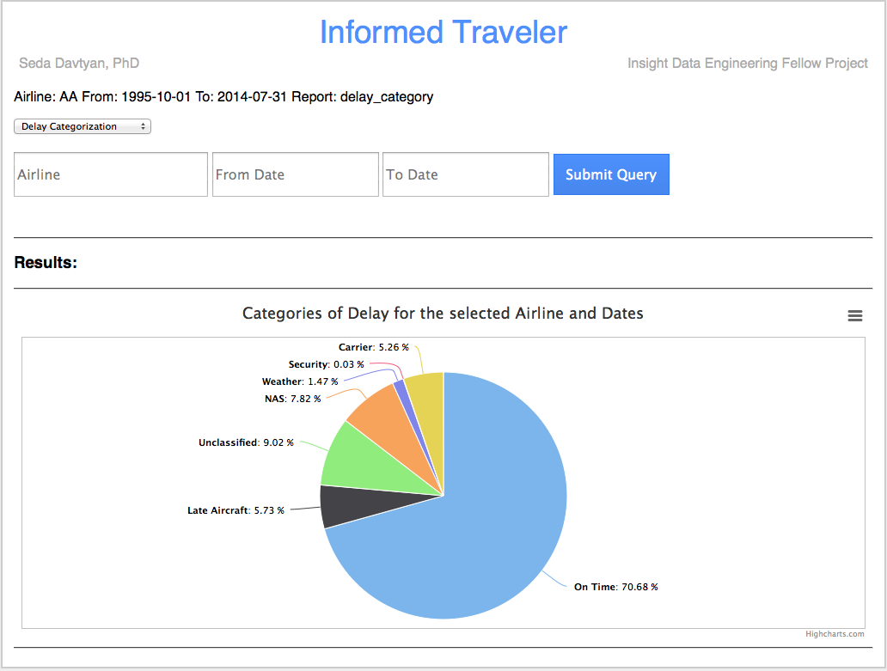

Informed Traveler
=================

Pick an airline wisely, be informed!
====================================

**Introduction**

[Informed Traveler](http://youtu.be/Qi5iCL9wFRg) is a web application that can be used for fast and user friendly querying of *Airline On-Time Performance* Data available from the *RITA (Research and Innovative Technology and Administration)* web site [RITA](http://www.rita.dot.gov). The data is updated on a quarterly basis and it goes back to October 1987. The historic data amounts to 65GB. The presentation for this project can be downloaded from [Slideshare](http://www.slideshare.net/sdavtyan/inform-trav).

To automatically download the data I used [rita_data_download.sh](../informed-traveler/master/shell_scripts). I then did some pre-processing using shell scripts (can be found under [shell_scripts](../shell_scripts)) prior to putting the data on to HDFS.

Here is the data pipeline that I used for my project:

As you can see I used **Pig** for batch processing. Using *Pig Latin* I cleaned the data and performed the necessary aggregations to show the delay ratios per category. The data is not clean and there are missing fields. As a result not all delays are categorized, I added an *Unclassified* category that combines all such delays.

As a NoSQL Database I used HBase, and I used HBaseStorage to insert the data into HBase.

I used Flask API and Python to implement the user interface. To plot the data I used [highcharts](http://www.highcharts.com). 

Snapshot of the User Interface and  Query Results:
---------------------------------------

